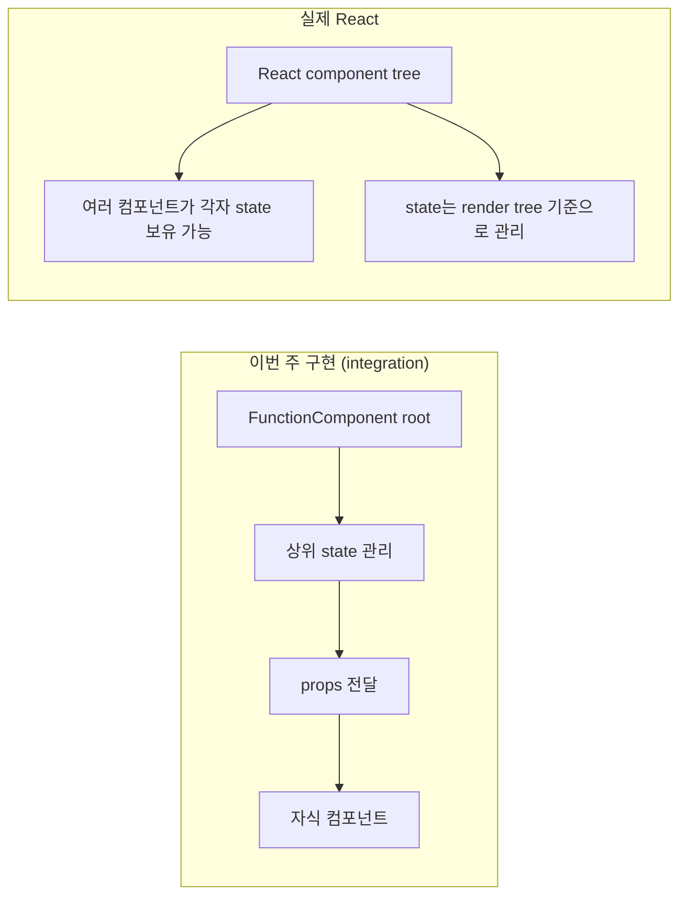
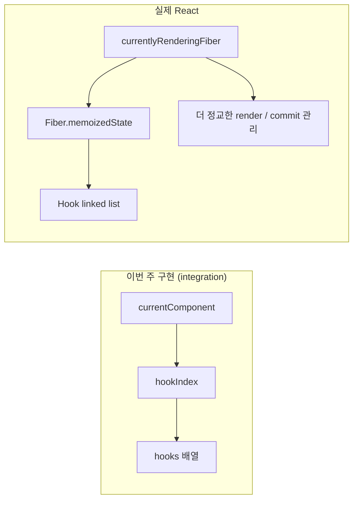
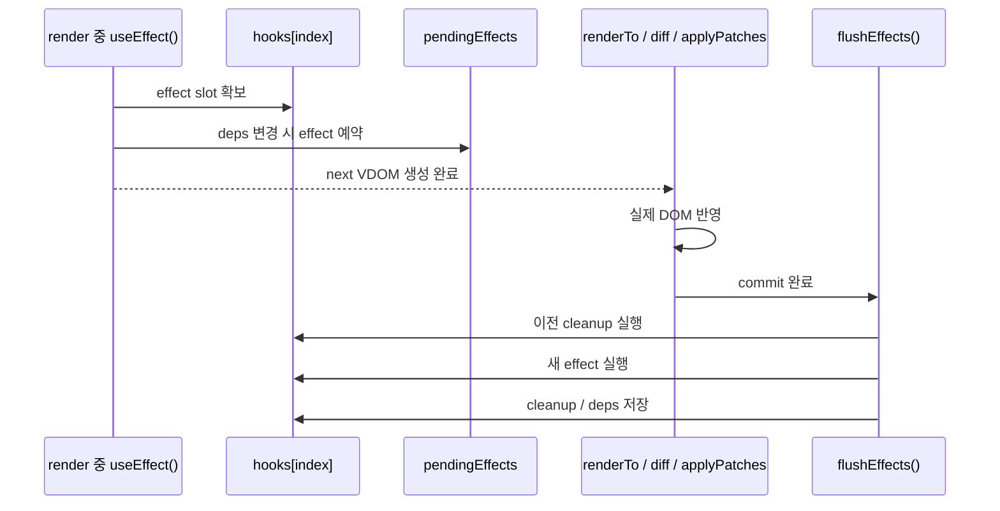

## 이번 주 구현 vs 실제 React

| 핵심 개념 | 이번 주 구현 (integration) | 실제 React |
|---|---|---|
| Component / State 구조 | `FunctionComponent`를 기반으로 컴포넌트 트리를 직접 관리했다. 앱 레벨에서는 state를 상위 컴포넌트에 모아두고, 이를 props로 자식 컴포넌트에 전달하는 방식으로 구조를 단순화했다. | 실제 React도 컴포넌트 단위로 UI를 구성하지만, state는 렌더 트리 전반에서 더 유연하게 관리되며 각 컴포넌트가 독립적으로 state를 가질 수 있다. |
| Hooks | 렌더링 시 현재 컴포넌트와 hook 호출 순서를 추적하는 방식으로 `useState`, `useEffect`, `useMemo`를 직접 구현했다. | 실제 React는 동일한 개념을 기반으로 하지만, Fiber 아키텍처 위에서 더 정교한 Hook 관리 방식과 다양한 Hook, 그리고 여러 최적화 기법을 함께 제공한다. |

1. Component / State 구조 차이

그림 2. Hooks 구조 차이

##

### 훅 useEffect() 실행 흐름

### useState() 실행 흐름

