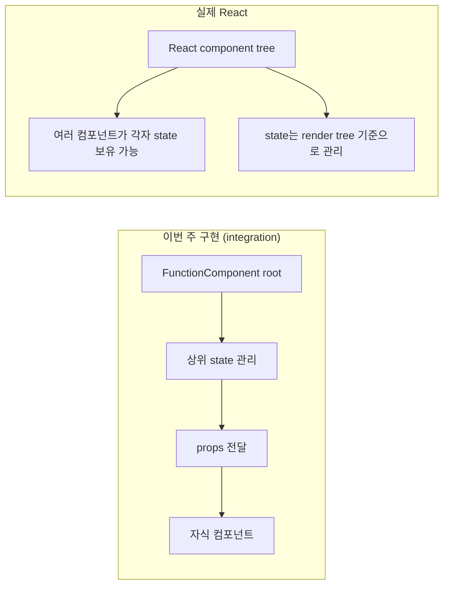
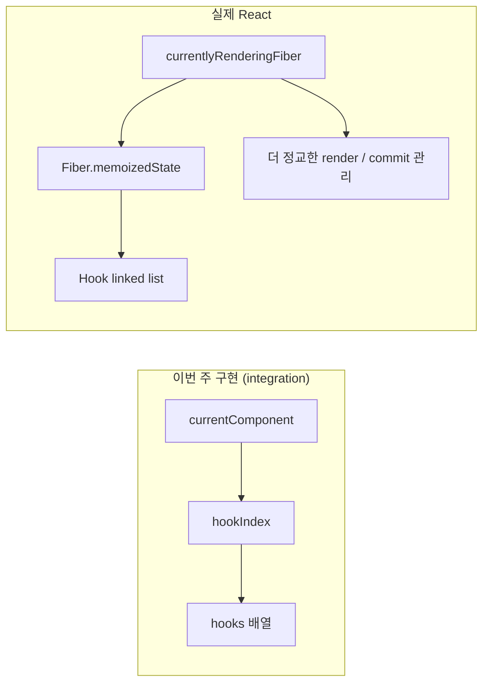
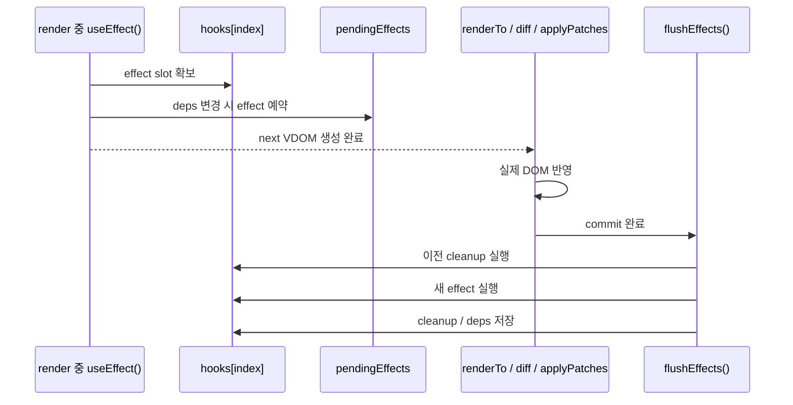

## 이번 주 구현 vs 실제 React

| 핵심 개념 | 이번 주 구현 (integration) | 실제 React |
|---|---|---|
| Component / State 구조 | `FunctionComponent`를 기반으로 컴포넌트 트리를 직접 관리했다. 앱 레벨에서는 state를 상위 컴포넌트에 모아두고, 이를 props로 자식 컴포넌트에 전달하는 방식으로 구조를 단순화했다. | 실제 React도 컴포넌트 단위로 UI를 구성하지만, state는 렌더 트리 전반에서 더 유연하게 관리되며 각 컴포넌트가 독립적으로 state를 가질 수 있다. |
| Hooks | 렌더링 시 현재 컴포넌트와 hook 호출 순서를 추적하는 방식으로 `useState`, `useEffect`, `useMemo`를 직접 구현했다. | 실제 React는 동일한 개념을 기반으로 하지만, Fiber 아키텍처 위에서 더 정교한 Hook 관리 방식과 다양한 Hook, 그리고 여러 최적화 기법을 함께 제공한다. |

1. Component / State 구조 차이


그림 2. Hooks 구조 차이


##

### 훅 useEffect() 실행 흐름



### useState() 실행 흐름


1.useState는 상태를 컴포넌트 함수 내부에 직접 저장하지 않고, FunctionComponent 인스턴스의 hooks[] 배열에 저장한다.  

2.예를 들어 BoardRoot()에서 첫 번째로 호출된 useState는 tasks 상태를 hooks[0]에 저장하며, setTasks()가 호출되면 이 슬롯의 값이 새로운 상태로 갱신된다.  

3.이후 루트 update()가 실행되면 BoardRoot()는 다시 호출되지만, 렌더 시작 시 hook 순서를 0부터 다시 맞추기 때문에 첫 번째 useState는 다시 hooks[0]을 읽는다.  

4.이 구조 덕분에 함수는 매번 새로 실행되어도 상태는 유지되며, 마지막에는 새 VDOM과 이전 VDOM을 비교해 변경된 DOM만 갱신한다.

## 테스트는 어떻게 했는지?

테스트는 네 단계로 나눴다.

| 분류 | 목적 |
| --- | --- |
| Unit Test | 각 모듈이 자기 책임을 제대로 수행하는지 확인 |
| Contract Test | 공통 포맷과 계약이 깨지지 않는지 확인 |
| Integration Test | patch, undo, redo까지 전체 흐름이 연결되는지 확인 |
| Concurrency-like / Load Test | 빠른 연속 실행, 큰 입력, 반복 churn에서도 안정적인지 확인 |


## Development Cycles


조금 더 한국어 느낌으로 바꾸면 이 버전도 괜찮습니다.

```md
## Development Cycles

```mermaid
pie showData
    title 수요 코딩회 작업 비중 (총 640분)
    "요구사항 정리 + 개념 학습 (305분)" : 305
    "공유 + 질문 (100분)" : 100
    "구현 (90분)" : 90
    "베이스 프로젝트 선정 (30분)" : 30
    "README 작성 (75분)" : 75
    "통합 (40분)" : 40


 
