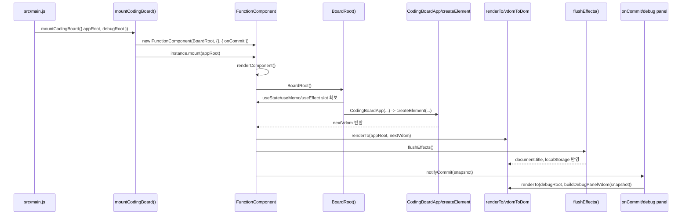
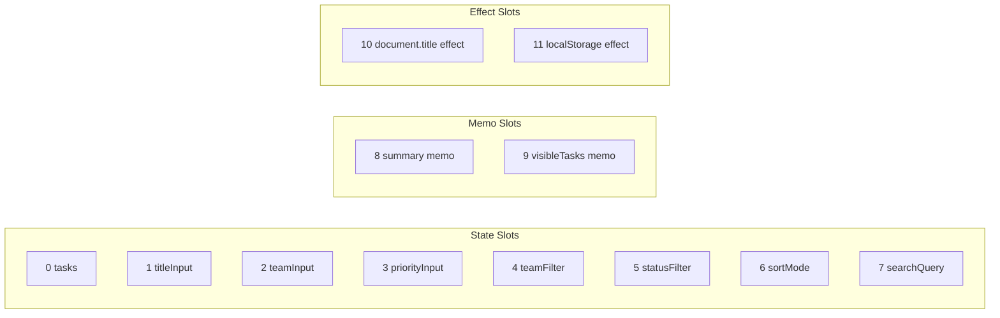
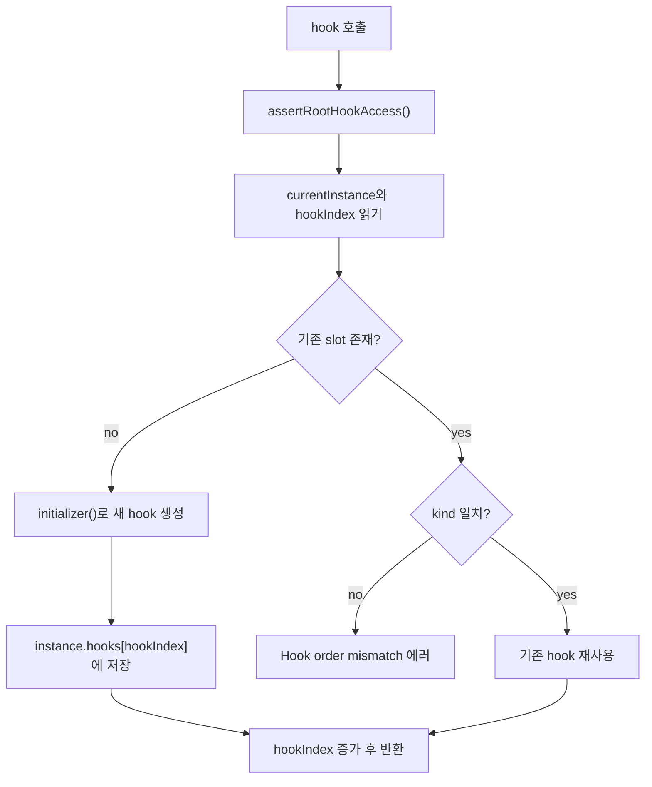
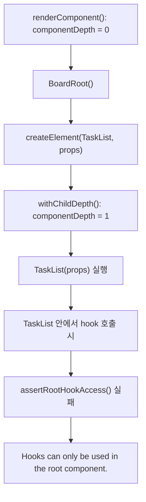
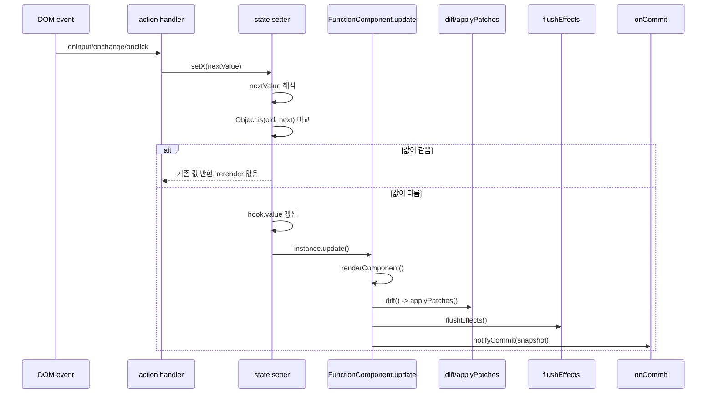
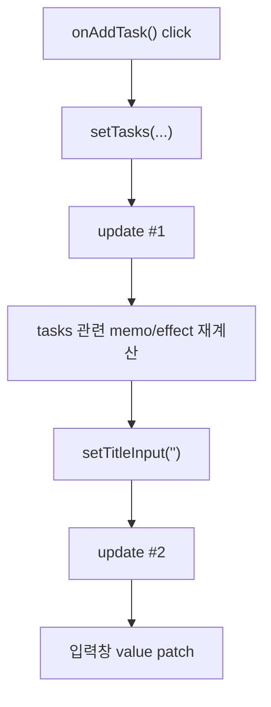
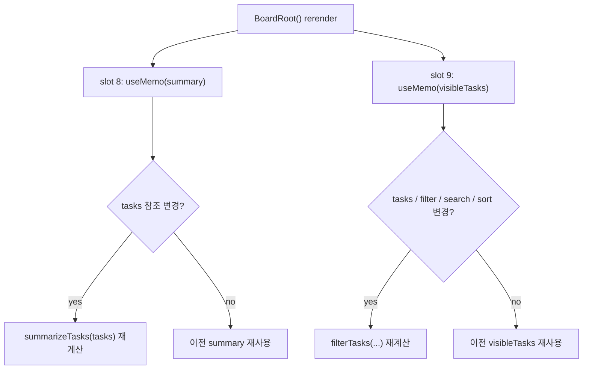
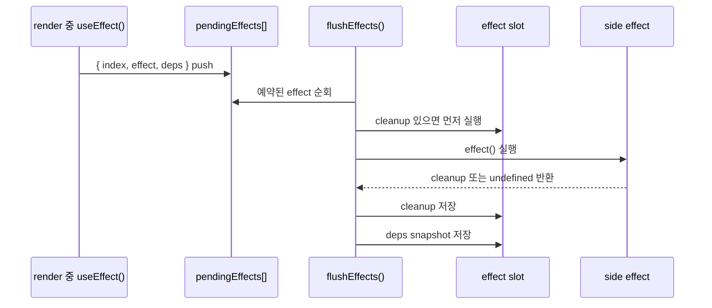
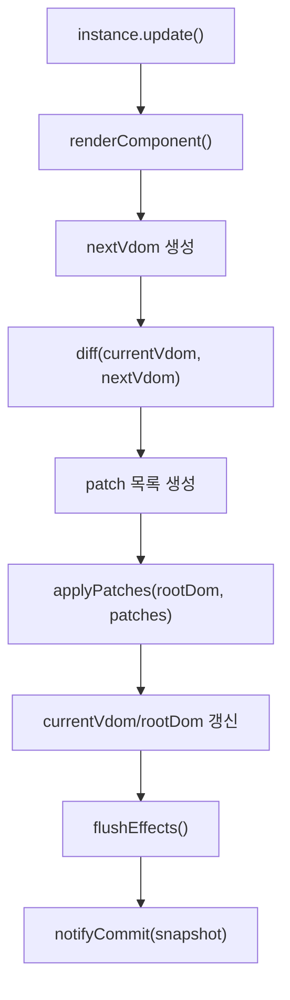
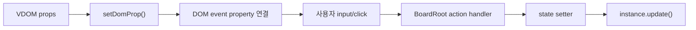

# Mini React Hook Runtime Flow Tutorial

> 참고: 이 문서는 root-only hook 설계 시점을 기준으로 작성된 부분이 있습니다. 현재 런타임은 child component hook과 keyed component identity를 지원합니다.

## 1. 문서 목적

이 문서는 현재 프로젝트에서 구현한 React-like hook 런타임이 실제로 어떤 순서로 실행되는지, 그리고 그 과정에서 어떤 파일의 어떤 함수가 호출되는지를 코드 기준으로 추적한 튜토리얼이다.

특히 아래 3가지를 중심으로 설명한다.

1. 앱이 처음 mount될 때 `BoardRoot`와 hook들이 어떤 순서로 실행되는가
2. 사용자 이벤트가 발생했을 때 `useState`가 어떻게 rerender를 만들고, 그 결과가 `diff`와 `applyPatches`를 거쳐 DOM에 반영되는가
3. `useMemo`, `useEffect`가 어떤 공통 규칙으로 slot을 잡고, 언제 다시 계산되거나 실행되는가

이 문서는 현재 코드 기준으로 작성했다.

- 엔트리: `src/main.js`
- 앱 mount: `src/app/mountCodingBoard.js`
- hook/runtime 핵심: `src/runtime/index.js`
- 화면 VDOM 구성: `src/app/codingBoardApp.js`
- DOM 반영: `src/lib/renderTo.js`, `src/lib/vdomToDom.js`, `src/lib/diff.js`, `src/lib/applyPatches.js`, `src/lib/domProps.js`
- 검증 테스트: `tests/runtime/*.test.js`, `tests/integration/codingBoard.test.js`

## 2. 먼저 잡아둘 실행 모델

이 프로젝트의 hook 런타임은 "컴포넌트마다 state가 따로 있는 구조"가 아니라, "루트 `FunctionComponent` 인스턴스 하나가 모든 hook slot을 들고 있는 구조"다.

핵심 특징은 다음과 같다.

| 항목 | 현재 구현 |
| --- | --- |
| state 저장 위치 | `FunctionComponent` 인스턴스의 `hooks[]` 하나 |
| hook 식별 방식 | 호출 순서 + `hookIndex` |
| hook 허용 범위 | `componentDepth === 0`인 루트 렌더 중 |
| 첫 렌더 DOM 반영 | `renderTo()`로 통째로 그림 |
| 업데이트 DOM 반영 | `diff()` + `applyPatches()` |
| effect 실행 시점 | DOM 반영 직후 `flushEffects()` |
| update 방식 | 성공한 `setState`마다 즉시 `instance.update()` |
| batching | 없음 |

즉, 이 런타임은 다음 한 줄로 요약할 수 있다.

`root render -> hooks[] slot 재사용/생성 -> next VDOM 생성 -> mount는 renderTo, update는 diff/patch -> effect flush -> debug snapshot`

## 3. 프로젝트에서 hook 흐름에 직접 관련된 파일

| 파일 | 핵심 함수 | 역할 |
| --- | --- | --- |
| `src/main.js` | 최상위 실행부 | DOM root를 찾고 `mountCodingBoard()`를 호출한다 |
| `src/app/mountCodingBoard.js` | `BoardRoot`, `mountCodingBoard` | 루트 상태와 hook 선언 순서를 정의한다 |
| `src/runtime/index.js` | `FunctionComponent`, `createElement`, `useState`, `useEffect`, `useMemo` | hook slot 관리와 render/update/effect flush를 담당한다 |
| `src/app/codingBoardApp.js` | `CodingBoardApp` 및 하위 view 함수들 | 루트 state를 받아 최종 VDOM을 만든다 |
| `src/lib/renderTo.js` | `renderTo` | 초기 mount 때 VDOM을 실제 DOM으로 바꿔 그린다 |
| `src/lib/vdomToDom.js` | `vdomToDom` | VDOM을 재귀적으로 실제 DOM 노드로 바꾼다 |
| `src/lib/domProps.js` | `setDomProp`, `removeDomProp` | `oninput`, `onclick`, `value` 같은 prop을 DOM에 연결한다 |
| `src/lib/diff.js` | `diff` | 이전 VDOM과 다음 VDOM의 차이를 patch 목록으로 만든다 |
| `src/lib/applyPatches.js` | `applyPatches` | patch를 실제 DOM에 적용한다 |

## 4. 첫 mount의 전체 흐름

아래 다이어그램은 앱이 처음 열렸을 때의 실제 호출 흐름을 요약한 것이다.



### 4.1 실제 코드 순서

1. `src/main.js`
   `#app-root`, `#debug-root`를 찾은 뒤 `mountCodingBoard({ appRoot, debugRoot })`를 호출한다.
2. `src/app/mountCodingBoard.js`
   `mountCodingBoard()`가 `new FunctionComponent(BoardRoot, {}, { onCommit })`를 만든다.
3. `src/app/mountCodingBoard.js`
   `instance.mount(appRoot)`를 호출한다.
4. `src/runtime/index.js`
   `FunctionComponent.mount()`가 `renderComponent()`를 실행한다.
5. `src/runtime/index.js`
   `renderComponent()`가 `renderContext.currentInstance = this`, `hookIndex = 0`, `componentDepth = 0`으로 초기화한다.
6. `src/runtime/index.js`
   `renderComponent()`가 루트 컴포넌트인 `BoardRoot(this.props)`를 직접 호출한다.
7. `src/app/mountCodingBoard.js`
   `BoardRoot()` 안에서 `useState`, `useMemo`, `useEffect`가 선언 순서대로 실행되며 `hooks[]` slot을 잡는다.
8. `src/app/mountCodingBoard.js`
   `BoardRoot()`는 `CodingBoardApp(createBoardProps(...))`를 반환한다.
9. `src/app/codingBoardApp.js`
   `CodingBoardApp()`와 그 아래 view 함수들이 `createElement()`를 이용해 최종 VDOM 트리를 만든다.
10. `src/lib/renderTo.js`
    `renderTo(appRoot, nextVdom)`가 최초 DOM을 통째로 그린다.
11. `src/lib/vdomToDom.js`
    `vdomToDom()`가 VDOM을 실제 DOM으로 바꾸고, `setDomProp()`가 이벤트 핸들러와 값 prop을 연결한다.
12. `src/runtime/index.js`
    `mount()`는 `currentVdom`, `rootDom`, `renderCount`를 저장한다.
13. `src/runtime/index.js`
    `flushEffects()`가 mount 중 예약된 effect들을 실행한다.
14. `src/runtime/index.js`
    `notifyCommit()`가 `onCommit(snapshot)`를 호출한다.
15. `src/app/mountCodingBoard.js`
    `onCommit()` 안에서 `buildDebugPanelVdom(snapshot)`를 만들고 `renderTo(debugRoot, debugVdom)`로 디버그 패널을 다시 그린다.

## 5. hook slot은 어디에, 어떤 순서로 저장되는가

현재 앱의 hook 순서는 `BoardRoot()` 함수에 완전히 고정되어 있다. 소스 순서가 slot 번호가 된다.

`BoardRoot()`의 선언 순서를 그대로 펼치면 다음과 같다.

| Slot | Hook | 소스 | 의미 |
| --- | --- | --- | --- |
| 0 | `useState(() => readInitialTasks())` | `src/app/mountCodingBoard.js` | 작업 배열 |
| 1 | `useState("")` | `src/app/mountCodingBoard.js` | 작업명 입력값 |
| 2 | `useState("플랫폼")` | `src/app/mountCodingBoard.js` | 팀 선택값 |
| 3 | `useState("medium")` | `src/app/mountCodingBoard.js` | 우선순위 선택값 |
| 4 | `useState("all")` | `src/app/mountCodingBoard.js` | 팀 필터 |
| 5 | `useState("all")` | `src/app/mountCodingBoard.js` | 상태 필터 |
| 6 | `useState("latest")` | `src/app/mountCodingBoard.js` | 정렬 방식 |
| 7 | `useState("")` | `src/app/mountCodingBoard.js` | 검색어 |
| 8 | `useMemo(() => summarizeTasks(tasks), [tasks])` | `src/app/mountCodingBoard.js` | 요약 카드용 계산값 |
| 9 | `useMemo(() => filterTasks(...), [tasks, teamFilter, statusFilter, searchQuery, sortMode])` | `src/app/mountCodingBoard.js` | 화면에 보여줄 작업 목록 |
| 10 | `useEffect(() => { document.title = ... }, [summary.remaining])` | `src/app/mountCodingBoard.js` | 브라우저 title 갱신 |
| 11 | `useEffect(() => { localStorage.setItem(...) }, [tasks])` | `src/app/mountCodingBoard.js` | 작업 저장 |



이 순서가 바뀌면 `getHook()`가 이전 slot의 `kind`와 현재 호출된 hook 종류를 비교하다가 `Hook order mismatch at index ...` 에러를 낸다.

## 6. hook 공통 규칙: `renderContext`, `getHook()`, `componentDepth`

세 hook은 모두 `getHook(kind, initializer)`를 통해 같은 규칙으로 slot을 잡는다.

### 6.1 `renderContext`가 들고 있는 것

`src/runtime/index.js`의 `renderContext`는 3가지를 가진다.

- `currentInstance`: 지금 렌더 중인 루트 `FunctionComponent`
- `hookIndex`: 이번 렌더에서 다음 hook이 들어갈 slot 번호
- `componentDepth`: 현재 함수 호출이 루트인지, `createElement(Child)`로 들어간 자식인지 구분하는 값

### 6.2 `getHook()`의 동작



핵심은 "hook은 이름으로 찾지 않고, 호출 순서로 slot을 찾는다"는 점이다.

### 6.3 왜 자식 컴포넌트에서는 hook이 막히는가

`createElement(type, props, ...children)`는 `type`이 함수면 그 함수를 나중에 남겨두지 않고 즉시 실행한다. 이때 `withChildDepth()`로 `componentDepth`를 1 증가시킨 뒤 실행한다.



이 제약은 테스트로도 확인된다.

- `tests/runtime/useState.test.js`
- `tests/runtime/useEffect.test.js`
- `tests/runtime/useMemo.test.js`

### 6.4 코드 리뷰 관점에서 꼭 짚을 점

현재 guard는 "진짜 React의 컴포넌트 경계"를 검사하는 것이 아니라, "지금 `createElement()`가 child depth를 올린 상태인지"를 검사한다.

그래서 `BoardRoot()`가 `CodingBoardApp(...)`를 일반 함수 호출로 직접 실행하는 현재 구조에서는 `CodingBoardApp` 자체는 depth 0에서 실행된다. 현재 코드에서는 `CodingBoardApp`에 hook을 넣지 않아서 문제가 없지만, 엄밀히 말하면 hook 허용 범위는 "루트 함수 몸체와 그 안에서 직접 호출한 helper"에 더 가깝다.

## 7. `useState`는 어떻게 동작하는가

### 7.1 hook record 모양

`useState`가 처음 slot을 만들 때 저장하는 값은 아래 형태다.

```js
{
  kind: "state",
  value,
  setter: null,
  owner: instance
}
```

여기서 중요한 것은 `owner`다. setter는 렌더가 끝난 뒤에도 살아 있어야 하므로, 자신을 다시 렌더할 루트 인스턴스를 기억해야 한다.

### 7.2 첫 렌더

첫 렌더에서 `useState(initialValue)`는 아래 순서로 실행된다.

1. `getHook("state", initializer)`를 호출한다.
2. 해당 slot이 비어 있으면 initializer가 실행된다.
3. `initialValue`가 함수면 즉시 한 번 실행해서 lazy initial value를 만든다.
4. `{ kind: "state", value, setter: null, owner }`를 slot에 저장한다.
5. `setter`가 아직 없으므로 그 자리에서 setter 함수를 생성해 `hook.setter`에 넣는다.
6. `[hook.value, hook.setter]`를 반환한다.

`tasks` state는 이 흐름의 대표 예시다.

- `useState(() => readInitialTasks())`
- 첫 mount 때만 `readInitialTasks()`가 실행된다
- 이후 rerender에서는 기존 slot의 `value`를 그대로 재사용한다

### 7.3 setter 호출

`useState`의 setter는 아래 순서로 동작한다.



### 7.4 실제 앱 예시 1: 검색 input

검색창은 `src/app/codingBoardApp.js`에서 `oninput: onSearch`로 연결되어 있고, `BoardRoot`에서는 `onSearch: (event) => setSearchQuery(event.target.value)`로 이어진다.

즉 실제 호출 흐름은 아래와 같다.

1. DOM `input` 이벤트 발생
2. `setDomProp()`가 연결해 둔 `element.oninput` 실행
3. `onSearch(event)` 실행
4. `setSearchQuery(event.target.value)` 호출
5. slot 7의 `hook.value` 변경
6. `instance.update()` 즉시 실행
7. `BoardRoot()` 재실행
8. slot 8 `summary` memo는 deps가 그대로라 캐시 재사용
9. slot 9 `visibleTasks` memo는 `searchQuery` deps가 바뀌어서 재계산
10. `diff()`와 `applyPatches()`가 작업 목록과 필터 표시를 patch
11. `summary.remaining`과 `tasks`가 안 바뀌었으므로 effect slot 10, 11은 예약되지 않음
12. 디버그 패널이 새 snapshot으로 다시 그림

### 7.5 실제 앱 예시 2: 작업 추가 버튼

`onAddTask()`는 setter를 2번 호출한다.

1. `setTasks(...)`
2. `setTitleInput("")`

이 런타임에는 batching이 없기 때문에, 성공하면 update도 2번 발생한다.



즉 "작업 추가"는 React처럼 한 번에 묶이지 않고, 현재 구현에서는 두 번의 commit으로 나뉜다.

### 7.6 테스트로 확인되는 성질

- `tests/runtime/useState.test.js`
  functional update로 값이 누적되고, `renderCount`가 mount 포함 3이 된다
- `tests/runtime/useState.test.js`
  같은 값을 다시 넣으면 `Object.is`에 걸려 rerender가 생기지 않는다

## 8. `useMemo`는 어떻게 동작하는가

### 8.1 hook record 모양

`useMemo` slot은 아래 형태를 가진다.

```js
{
  kind: "memo",
  deps: undefined,
  value: undefined
}
```

### 8.2 공통 비교 함수: `depsChanged()`

`useMemo`와 `useEffect`는 둘 다 같은 `depsChanged(previousDeps, nextDeps)`를 쓴다.

비교 규칙은 다음과 같다.

1. 이전 deps가 없으면 변경으로 본다
2. 다음 deps가 없으면 변경으로 본다
3. 길이가 다르면 변경으로 본다
4. 하나라도 `Object.is`가 false면 변경으로 본다

즉 deps 배열을 생략하면 "매 render마다 다시 계산/다시 실행"이 된다.

### 8.3 `useMemo`의 실행 흐름

1. `getHook("memo", initializer)`로 slot을 찾는다.
2. `depsChanged(hook.deps, deps)`를 검사한다.
3. 변경이면 `factory()`를 실행하고 `hook.value`와 `hook.deps`를 갱신한다.
4. 변경이 아니면 이전 `hook.value`를 그대로 반환한다.

### 8.4 현재 앱에서의 `useMemo` 2개



### 8.5 어떤 입력이 어떤 memo를 다시 계산시키는가

| 변경된 state | slot 8 `summary` | slot 9 `visibleTasks` |
| --- | --- | --- |
| `titleInput` | 재사용 | 재사용 |
| `teamInput` | 재사용 | 재사용 |
| `priorityInput` | 재사용 | 재사용 |
| `teamFilter` | 재사용 | 재계산 |
| `statusFilter` | 재사용 | 재계산 |
| `sortMode` | 재사용 | 재계산 |
| `searchQuery` | 재사용 | 재계산 |
| `tasks` | 재계산 | 재계산 |

이건 현재 deps 배열 선언과 정확히 일치한다.

### 8.6 테스트로 확인되는 성질

`tests/runtime/useMemo.test.js`에서는 아래를 검증한다.

1. `setQuery("memo")`는 `count` deps를 건드리지 않아서 memo factory를 다시 실행하지 않는다
2. `setCount(2)`는 deps를 바꾸므로 다시 계산한다

그래서 최종 `computeCount`가 2가 된다.

## 9. `useEffect`는 어떻게 동작하는가

### 9.1 hook record 모양

`useEffect` slot은 아래 형태를 가진다.

```js
{
  kind: "effect",
  deps: undefined,
  cleanup: null
}
```

### 9.2 render 단계에서는 effect를 "실행"하지 않고 "예약"만 한다

`useEffect(effect, deps)`가 호출되면 아래 일만 한다.

1. `getHook("effect", initializer)`로 slot을 찾는다
2. `depsChanged(hook.deps, deps)`를 확인한다
3. 변경이면 `currentInstance.pendingEffects.push({ index, effect, deps })` 한다

즉 render 중에는 side effect를 바로 실행하지 않는다. 단지 `pendingEffects` 큐에 넣어 둔다.

### 9.3 effect는 commit 직후 `flushEffects()`에서 실행된다



### 9.4 현재 앱의 effect 2개

현재 앱에서 effect는 정확히 두 개다.

1. slot 10
   `document.title = 남은 작업 n개 | 수요 코딩회 보드`
2. slot 11
   `localStorage.setItem(STORAGE_KEY, JSON.stringify(tasks))`

첫 mount 때는 두 effect 모두 이전 deps가 없으므로 실행된다.

업데이트 때는 아래처럼 갈린다.

| 상황 | slot 10 title effect | slot 11 storage effect |
| --- | --- | --- |
| 검색어 변경 | 실행 안 함 | 실행 안 함 |
| 정렬 변경 | 실행 안 함 | 실행 안 함 |
| 상태 토글 | `summary.remaining`이 바뀌면 실행 | `tasks`가 바뀌므로 실행 |
| 작업 추가 | 실행 | 실행 |

### 9.5 cleanup 순서

`flushEffects()`는 새 effect를 실행하기 전에 기존 cleanup을 먼저 실행한다.

이 흐름은 `tests/runtime/useEffect.test.js`의 결과와 정확히 맞는다.

1. mount 시 `run:0`
2. `setFlag(true)`는 deps `[count]`를 안 바꾸므로 effect 없음
3. `setCount(1)`은 deps를 바꾸므로 `cleanup:0` 후 `run:1`

그래서 기대값이 `["run:0", "cleanup:0", "run:1"]`가 된다.

### 9.6 현재 구현에서의 한계

현재 런타임에는 별도의 unmount API가 없기 때문에, "루트가 사라질 때 마지막 cleanup을 강제로 실행하는 흐름"은 구현되어 있지 않다. cleanup은 현재 코드 기준으로 "같은 effect slot이 다음 commit에서 다시 실행될 때"만 호출된다.

## 10. update 때는 왜 `renderTo()`가 아니라 `diff/applyPatches()`를 쓰는가

`FunctionComponent`는 mount와 update를 다르게 처리한다.

| 단계 | mount | update |
| --- | --- | --- |
| VDOM 생성 | `renderComponent()` | `renderComponent()` |
| DOM 반영 | `renderTo(container, nextVdom)` | `diff(currentVdom, nextVdom)` 후 `applyPatches(rootDom, patches)` |
| renderCount 증가 | O | O |
| effect flush | O | O |
| debug snapshot | O | O |

즉 hook 관점에서 mount와 update는 둘 다 비슷하게 보이지만, DOM 반영 경로만 다르다.

업데이트 경로를 도식화하면 아래와 같다.



## 11. DOM 이벤트가 hook update를 일으키는 연결점

`src/lib/domProps.js`의 `setDomProp()`는 `oninput`, `onchange`, `onclick` 같은 prop을 실제 DOM property에 바로 연결한다.

즉 이 프로젝트의 이벤트 흐름은 다음과 같다.

1. VDOM에 `onclick`, `oninput`, `onchange`가 들어 있다
2. `vdomToDom()` 또는 `applyPatches()`가 `setDomProp()`를 호출한다
3. `element.onclick = handler`, `element.oninput = handler` 식으로 DOM에 연결된다
4. 브라우저 이벤트가 발생하면 handler가 바로 실행된다
5. handler 안의 `setState()`가 즉시 `instance.update()`를 부른다



테스트에서도 이 연결이 확인된다.

- `tests/runtime/events.test.js`
  `vdomToDom()`이 `onclick`과 `oninput`을 DOM에 붙인다
- `tests/runtime/events.test.js`
  `applyPatches()`가 바뀐 이벤트 핸들러를 교체하고 제거한다

### 11.1 코드 리뷰 관점에서 보이는 추가 특징

`diffProps()`는 prop 값을 참조 비교한다. 현재 앱에서는 `actions` 객체와 각 이벤트 handler 함수가 rerender 때마다 새로 만들어지므로, 화면 텍스트가 같아도 일부 interactive 노드에는 `PROPS` patch가 자주 생길 수 있다.

이건 버그라기보다 현재 설계의 자연스러운 결과다.

- memoized handler가 없다
- `diffProps()`는 함수도 일반 prop처럼 `===` 비교한다
- `applyPatches()`는 변경된 handler를 다시 `setDomProp()`로 붙인다

디버그 패널의 `Patch Log`에서 `PROPS` 항목이 생각보다 자주 보이는 이유가 여기에 있다.

## 12. 디버그 패널은 무엇을 보여주는가

`mountCodingBoard()`는 `FunctionComponent`를 만들 때 `onCommit(snapshot)` 옵션을 넘긴다. 이 snapshot은 `getDebugSnapshot()`에서 만들어진다.

snapshot에는 아래가 들어 있다.

- `renderCount`
- `lastPatches`
- `patchLog`
- `effectLog`
- `hooks`

이 snapshot은 `buildDebugPanelVdom(snapshot)`으로 가공되어 `debugRoot`에 렌더된다.

즉 디버그 패널은 "hook runtime 내부 상태를 사람이 읽기 좋게 다시 VDOM으로 렌더한 화면"이다.

특히 발표나 디버깅 때 아래를 보면 흐름이 잘 보인다.

1. `Hook Slots`
   현재 slot 번호와 state/memo/effect snapshot
2. `Patch Log`
   어떤 path에 어떤 patch가 생겼는지
3. `Effect Log`
   어떤 effect slot이 cleanup/run 되었는지

## 13. 이 프로젝트의 hook 구현을 한 문장씩 요약하면

### `useState`

루트 `hooks[]` 배열의 특정 slot에 값을 저장하고, setter가 호출되면 값을 즉시 바꾼 뒤 루트 `instance.update()`를 바로 실행한다.

### `useMemo`

루트 `hooks[]`의 memo slot에 `value`와 `deps`를 저장하고, deps가 바뀌었을 때만 `factory()`를 다시 실행한다.

### `useEffect`

render 중에는 effect를 `pendingEffects`에 예약만 하고, DOM 반영이 끝난 직후 `flushEffects()`에서 cleanup 후 effect를 실행한다.

## 14. 최종 정리

현재 프로젝트의 hook 시스템은 실제 React처럼 보이는 API를 제공하지만, 내부 구조는 훨씬 단순하고 직선적이다.

핵심 실행 순서는 항상 아래로 귀결된다.

1. `BoardRoot()`가 hook을 선언 순서대로 읽는다
2. 각 hook은 `hooks[]`의 같은 slot을 재사용한다
3. 상태가 바뀌면 루트 전체를 다시 렌더한다
4. update면 `diff()`와 `applyPatches()`로 DOM을 최소 수정한다
5. 그 뒤 `flushEffects()`가 effect를 실행한다
6. 마지막에 디버그 패널이 snapshot을 보여준다

이 구조를 머릿속에 잡고 `debugRoot`를 같이 보면, `useState`, `useMemo`, `useEffect`가 실제로 어떻게 이어지는지 거의 실시간으로 추적할 수 있다.
