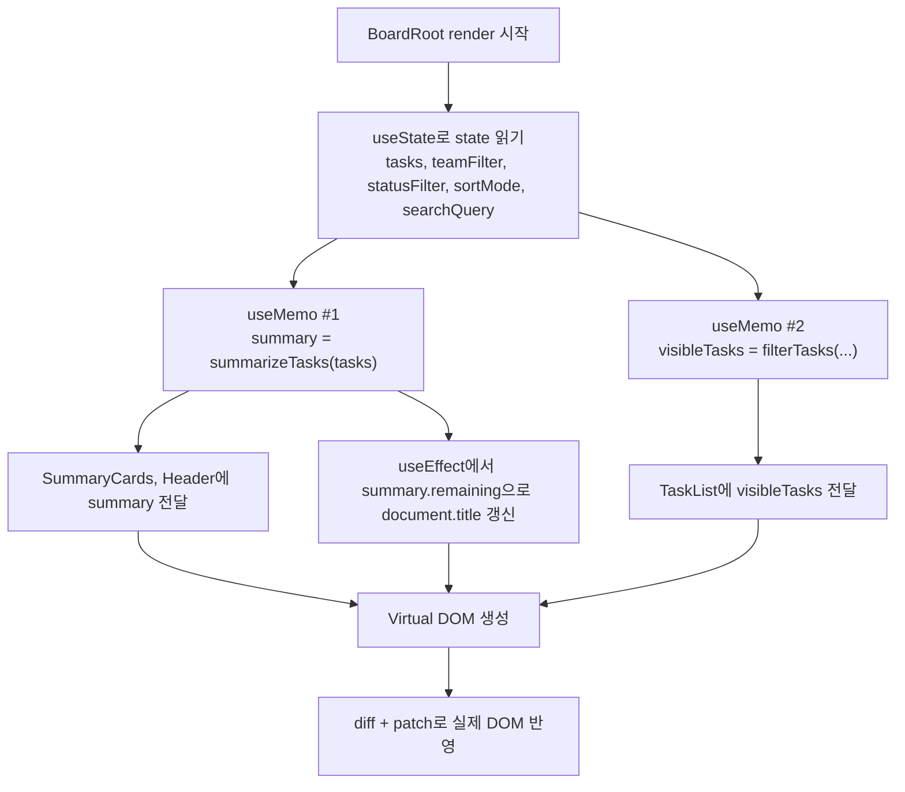
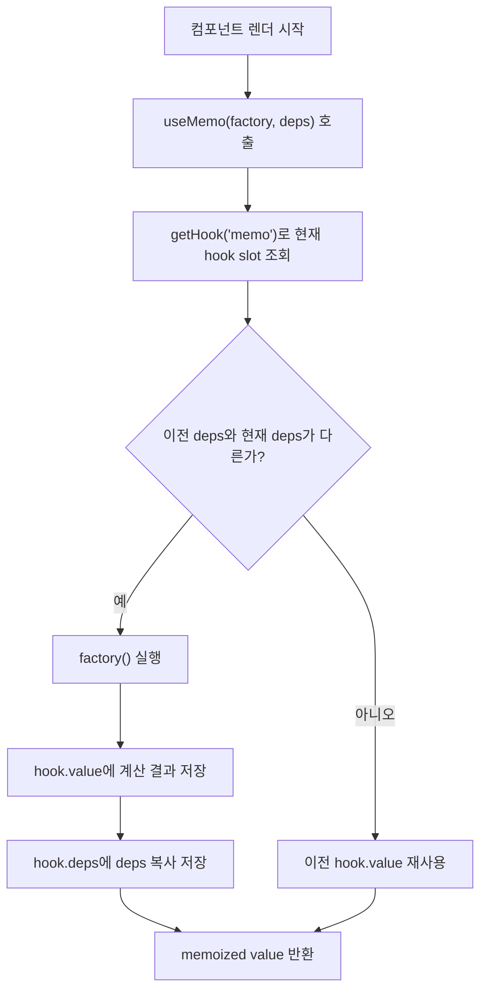

# useMemo 정리

이 문서는 현재 프로젝트에서 `useMemo`가 어디서 쓰이는지와, 실제 렌더 흐름에서 어떻게 동작하는지를 발표용으로 정리한 문서다.

## 1. 이 프로젝트에서 useMemo를 쓰는 위치

### 실제 호출 위치

1. `src/app/mountCodingBoard.js:26`

```js
const summary = useMemo(() => summarizeTasks(tasks), [tasks]);
```

- `tasks` 배열이 바뀔 때만 요약 정보를 다시 계산한다.
- 계산 결과는 `total`, `done`, `remaining`, `completion`이다.

2. `src/app/mountCodingBoard.js:27`

```js
const visibleTasks = useMemo(
  () =>
    filterTasks(tasks, {
      teamFilter,
      statusFilter,
      searchQuery,
      sortMode,
    }),
  [tasks, teamFilter, statusFilter, searchQuery, sortMode],
);
```

- 필터, 검색어, 정렬 기준, 원본 task 목록이 바뀔 때만 화면에 보여줄 목록을 다시 계산한다.

### 런타임 구현 위치

3. `src/runtime/index.js:564`

```js
export function useMemo(factory, deps) {
  const [hook] = getHook("memo", () => ({
    kind: "memo",
    deps: undefined,
    value: undefined,
  }));

  if (depsChanged(hook.deps, deps)) {
    hook.value = factory();
    hook.deps = deps === undefined ? undefined : [...deps];
  }

  return hook.value;
}
```

- 여기서 memo hook slot을 가져오고,
- deps가 바뀐 경우에만 `factory()`를 다시 실행하고,
- 바뀌지 않았으면 이전 `hook.value`를 그대로 재사용한다.

## 2. 왜 여기서 useMemo를 쓰는가

이 프로젝트에서 `useMemo`는 "state를 그대로 저장하는 용도"가 아니라, "state에서 파생되는 계산 결과를 캐싱하는 용도"로 쓰인다.

- `summary`
  - 원본 상태: `tasks`
  - 파생 값: 전체 개수, 완료 개수, 남은 개수, 완료율
- `visibleTasks`
  - 원본 상태: `tasks`, `teamFilter`, `statusFilter`, `searchQuery`, `sortMode`
  - 파생 값: 필터링되고 정렬된 최종 리스트

즉, `useMemo`는 "계산 결과를 다시 써도 되는 값"에 적용되어 있다.

## 3. BoardRoot에서의 흐름

`BoardRoot`는 먼저 state를 읽고, 그 다음 `useMemo`로 파생 데이터를 만들고, 그 결과를 UI 컴포넌트에 넘긴다.

순서는 다음과 같다.

1. `tasks`, `teamFilter`, `statusFilter`, `sortMode`, `searchQuery`를 `useState`로 읽는다.
2. `summary = useMemo(..., [tasks])`를 실행한다.
3. `visibleTasks = useMemo(..., [tasks, teamFilter, statusFilter, searchQuery, sortMode])`를 실행한다.
4. `summary`는 제목 표시와 통계 카드에 사용된다.
5. `visibleTasks`는 실제 task 목록 UI에 사용된다.
6. `summary.remaining`은 `useEffect`에서 `document.title` 갱신에도 사용된다.

## 4. 실제 렌더 흐름 다이어그램



## 5. useMemo 내부 동작 흐름

현재 프로젝트 런타임은 hook 배열의 "같은 인덱스"를 재사용하는 방식으로 memo 값을 유지한다.



## 6. 코드 기준으로 보면 중요한 포인트

### 1) hook slot 재사용

- `src/runtime/index.js:251`의 `getHook(...)`
- 렌더 순서대로 hook 배열 인덱스를 재사용한다.
- 그래서 같은 위치의 `useMemo`는 이전 렌더에서 저장한 값을 계속 꺼내 쓸 수 있다.

### 2) deps 비교

- `src/runtime/index.js:65`의 `depsChanged(...)`
- 이전 deps와 현재 deps를 `Object.is`로 비교한다.
- 하나라도 다르면 다시 계산한다.

### 3) 실제 캐시 저장

- `src/runtime/index.js:571-573`
- deps가 바뀌면:
  - `hook.value = factory()`
  - `hook.deps = [...deps]`

즉, `useMemo`의 핵심은 "이전 계산값과 이전 deps를 hook slot에 저장해두고, deps가 바뀐 경우에만 다시 계산하는 것"이다.

## 7. 발표할 때 이렇게 말하면 좋다

짧은 버전:

> 이 프로젝트에서 `useMemo`는 파생 데이터를 캐싱하는 역할을 합니다.  
> `tasks`로부터 통계 요약을 만들고, `tasks + 필터 조건`으로부터 화면에 보여줄 리스트를 만드는데, 관련 값이 바뀔 때만 다시 계산하도록 했습니다.

조금 더 자세한 버전:

> `BoardRoot`가 렌더될 때마다 `useMemo`는 먼저 현재 hook slot을 찾습니다.  
> 그리고 이전 deps와 현재 deps를 비교해서 달라졌으면 `factory`를 다시 실행하고, 같으면 이전 결과를 그대로 반환합니다.  
> 그래서 이 프로젝트에서는 `summary`와 `visibleTasks` 같은 파생 데이터를 불필요하게 매 렌더마다 다시 만들지 않도록 할 수 있습니다.

## 8. 발표 체크 포인트

- `useMemo`는 state를 저장하는 훅이 아니다.
- `useMemo`는 계산 결과를 재사용하는 훅이다.
- 이 프로젝트에서는 `summary`와 `visibleTasks`에 적용되어 있다.
- 동작 기준은 "deps가 바뀌었는가"이다.
- 내부적으로는 hook 배열의 같은 slot에 `value`와 `deps`를 저장한다.
